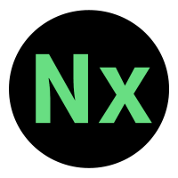
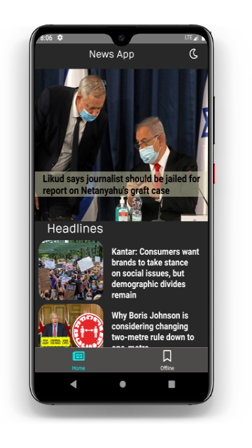

<h1 align="center">
  <br>
  
  <br>
  NewsX
</h1>

<h4 align="center">News app made using React native</h4>
<p align="center">
    
</p>

<p align="center">
  • <a href="#key-features">Key Features</a> •
  <a href="#how-to-use">Contribution</a>
</p>
<div align="center" style="display:inline;">


</div>


### Download link for apk file [Google Drive](https://drive.google.com/file/d/1zAFSQJ_3ctGec9_TZswVhX2VytEr8nIE/view?usp=sharing)

## 🎉 Key Features

* ### Live updates
* ### Bookmark/Offline Mode -
    - Caching of the bookmared articles for offline mode using react-native AsyncStorage
* ### Cross platform
  - Android, Ios compatible.

## 📖 Contribution Docs

To clone and run this application, you'll need [Git](https://git-scm.com) installed on your computer. From your command line:
#### This project still has scope of development, so you can also contribute to this Project as follows:
* [Fork](https://github.com/nis130/newx-react-native-app) this Repository
* Clone your Fork on a different branch:
```
	$ git clone -b <name-of-branch> https://github.com/nis130/newx-react-native-app.git
	
	$ cd newx-react-native-app
	
	#install all dependencies
	$ yarn install/ npm install
	
	#run app
	$ npx react-native run-android
	
```
* Add the News api url in home.js
* After adding any feature:
	* Goto your fork and create a pull request.
	* I will test your modifications and merge changes.

### Contributors

- [@nis130](https://github.com/nis130)
---
